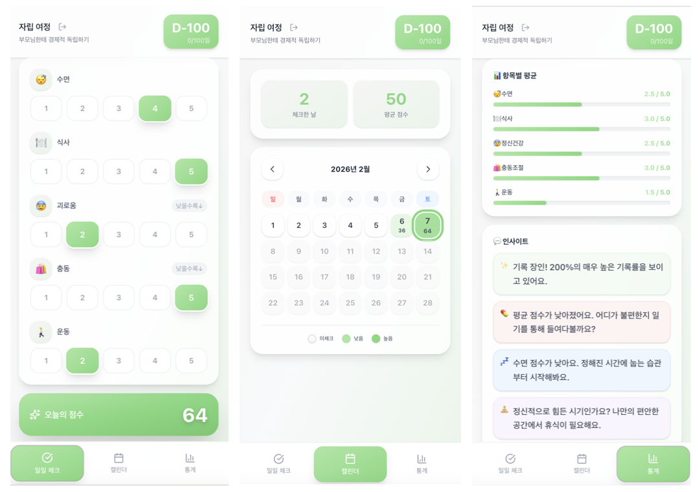

# 🌿 Stand-Alone (자립)

> **당신의 온전한 홀로서기를 위한 다정하고 체계적인 동반자, 스탠드-얼론**



## ✨ 서비스 소개
**Stand-Alone**은 단순히 할 일을 기록하는 앱이 아닙니다.  
불안정한 일상을 다듬고, 스스로를 돌보며 진정한 '자립'으로 나아가는 여정을 돕는 개인 성장 & 웰니스 트래커입니다.  
수면, 식사, 신체 활동과 같은 일상의 기본 지표부터 마음의 상태까지 한눈에 관리하세요.

---

## 🚀 주요 기능

### 1. 🎯 목표 설정 (Onboarding)
- 당신의 자립 여정을 시작할 첫 번째 목표와 기간을 설정합니다.
- 시작이 반입니다. 작지만 확실한 변화를 위한 첫 걸음을 기록하세요.

### 2. ✅ 스마트 일일 체크 (Daily Check)
- **5가지 핵심 지표**: 수면, 식사, 정신건강, 충동조절, 운동을 1~5점 척도로 기록합니다.
- **데일리 일기**: 그날의 감정과 사건을 짧게 기록하며 자신을 회복하는 시간을 가집니다.
- **실시간 점수 산출**: 입력한 지표에 따라 당신의 하루 자립 점수가 100점 만점으로 계산됩니다.

### 3. 🗓️ 비주얼 프로그레스 캘린더 (Calendar)
- **점수별 색상 농도**: 하루의 점수에 따라 캘린더의 색상이 다르게 표시되어, 나의 한 달 흐름을 직관적으로 파악할 수 있습니다.
- **기록 모달**: 과거의 날짜를 클릭하여 그날의 기록을 즉시 확인하고 수정할 수 있습니다.
- **미래 보호**: 아직 오지 않은 날짜는 수정할 수 없도록 제어되어 기록의 진실성을 유지합니다.

### 4. 📊 데이터 인사이트 & 통계 (Statistics)
- **주간/월간 추이**: 그래프를 통해 나의 점수가 어떻게 변화하고 있는지 확인하세요.
- **항목별 분석**: 어떤 부분(예: 수면)이 부족한지 시각적으로 보여줍니다.
- **지능형 인사이트**: 당신의 기록을 바탕으로 "수면 습관 개선", "휴식 권유" 등 맞춤형 조언을 제공합니다.

### 5. ☁️ 클라우드 동기화 & 보안
- **Supabase Integration**: 로그인/회원가입을 통해 어디서나 실시간으로 데이터를 동기화합니다.
- **로컬 캐싱 (RxDB)**: 오프라인 환경에서도 빠르게 앱을 사용할 수 있도록 로커 데이터베이스를 활용합니다.
- **데이터 격리**: 개별 사용자만의 독립적인 공간에서 안전하게 데이터를 관리합니다.

---

## 🛠 Tech Stack

- **Frontend**: Next.js 15+, React, TailwindCSS
- **State/Database**: RxDB (Local), Supabase (Remote DB & Auth)
- **Icons & UI**: Lucide React, Radix UI (Dialog), Sonner (Toasts)
- **Visualization**: Recharts

---

## ⚙️ 시작하기

1. **저장소 클론**
   ```bash
   git clone [repository-url]
   cd stand-alone
   ```

2. **의존성 설치**
   ```bash
   npm install
   ```

3. **환경 변수 설정**
   `.env.local` 파일을 생성하고 Supabase 정보를 입력하세요.
   ```env
   NEXT_PUBLIC_SUPABASE_URL=your-supabase-url
   NEXT_PUBLIC_SUPABASE_ANON_KEY=your-supabase-anon-key
   ```

4. **로컬 서버 실행**
   ```bash
   npm run dev
   ```

---

## 📱 Mobile App (Capacitor)

이 서비스는 Capacitor를 통해 iOS 및 Android 앱으로 빌드할 수 있습니다.

1. **빌드 및 동기화**
   ```bash
   npm run mobile:sync
   ```

2. **iOS 시뮬레이터/앱 실행** (Xcode 필요)
   ```bash
   npm run mobile:open:ios
   ```

3. **Android Studio/앱 실행** (Android Studio 필요)
   ```bash
   npm run mobile:open:android
   ```

---

## 🎨 Design Philosophy
Stand-Alone은 사용자에게 압박을 주지 않는 **'다정한 디자인'**을 지향합니다.  
부드러운 파스텔 그린 톤과 글래모피즘(Glassmorphism) 요소를 사용하여, 매일 들어오고 싶은 편안한 공간을 제공합니다.

---

*Made with ❤️ for your independence.*
